# AI Creation · Completed Deliverables

Thirty-two builds: single-file web pieces plus two native macOS apps. Most were made by Claude Code (the main session or parallel subagents); eight were first built by Codex or Muse and finished by Claude. Each section below shows the original task brief, the time spent actively working on it, the tokens it used, a screenshot, and a link to the output.

**▶ Live site: [aray4702.github.io/ai_creation](https://aray4702.github.io/ai_creation/)**, where every game, simulation and animation runs in your browser.

> [!NOTE]
> **Disclaimer:** Fan/educational project. Not affiliated with or endorsed by FromSoftware, Lockheed Martin, or any other trademark holder. Task prompts are inspired by content from the Internet; [contact me](https://github.com/aray4702/ai_creation/issues) for credit or removal.

| Tasks completed | Active agent time | Output tokens | Total tokens |
|:-:|:-:|:-:|:-:|
| **32** | **14h 25m** | **1.2M** | **127.3M** |

> **Active time** leaves out waiting for the usage limit to reset (about 4.3 h, twice) and any idle gap over 20 minutes. For each task it counts only the session work that finished it, not planning for other tasks or earlier attempts.
> **Total tokens** = fresh input + cache writes + cache reads + output; cache reads are most of it.
> The subagents ran in parallel, so their times overlap on the clock.
> Each output is a single self-contained HTML file. To run one, open it from the [live site](https://aray4702.github.io/ai_creation/); links on github.com show only the source.

## Contents

1. [Pure-Code Cinematic Short Film with Synthesized Score](#1-cinematic-short-film)
2. [Multi-Agent Painterly Animated Music Video Engine](#2-painterly-music-video)
3. [Rampart: 2D Castle Platformer](#3-castle-platformer)
4. [Ember Souls: Dark Souls–Style Action RPG](#4-souls-rpg)
5. [Apex Circuit: 3D Arcade Racing](#5-apex-circuit-racing)
6. [Kart Clash: Full Arcade Kart Racer](#6-kart-racing)
7. [3D Interactive Black Hole Simulation](#7-black-hole-simulation)
8. [3D 黑洞模拟器 (Black Hole Simulator, Chinese)](#8-black-hole-simulator-cn)
9. [F-35 Digital Wind Tunnel](#9-f35-wind-tunnel)
10. [Real-Time Viscous Thread Coiling (Honey)](#10-honey-coiling)
11. [Syrup on a Moving Conveyor Belt](#11-syrup-conveyor-belt)
12. [Saturn’s Rings Bird Bicycle Race (SVG)](#12-saturn-bird-race)
13. [Procedural Pixel Art Wizard](#13-pixel-wizard)
14. [Antikythera Mechanism Reconstruction](#14-antikythera-reconstruction)
15. [3D Gear-Driven Mechanical Calculator](#15-gear-calculator)
16. [Music Player (Apple Music–Style macOS App)](#16-music-player)
17. [悦听 Music Player (Chinese macOS App)](#17-music-player-cn)
18. [Fox Lantern Adventure: 3D Action Platformer](#18-fox-lantern-adventure)
19. [Easter Island Moai: Quarry to Pukao (摩艾全流程模拟)](#19-moai-process-simulator)
20. [Chinese Ink-Wash Painting (3 Scenes)](#20-ink-wash-painting)
21. [水墨 · 七幕 (Ink-Wash in Seven Acts, Chinese)](#21-ink-wash-seven-acts-cn)
22. [Interactive Procedural Wallpaper](#22-interactive-procedural-wallpaper)
23. [OVERDRIVE: 15-Second Kinetic Showreel](#23-kinetic-showreel)
24. [Voxel Tides: Browser Voxel Engine](#24-voxel-tides)
25. [Dead Signal: Atmospheric FPS](#25-dead-signal)
26. [Hikari: Glass Tiles from Day to Night](#26-glass-tile-cycle)
27. [Neutron Star: Magnetic Field and Polar Jets](#27-neutron-star)
28. [Butterfly Life Cycle](#28-butterfly-life-cycle)
29. [Void Wing: Space Dogfight & Asteroid Battle](#29-void-wing)
30. [Quantum Collapse: Two Observers vs Three (CN)](#30-quantum-collapse)
31. [Sketch Trebuchet: Drawing to Physics Simulator](#31-sketch-trebuchet)
32. [Acrylic Marker Flip Sketchbook](#32-acrylic-sketchbook)

---

## 1. Pure-Code Cinematic Short Film with Synthesized Score

**Media** · Main session

<a href="cinematic-short-film/qian_nu_you_hun.html">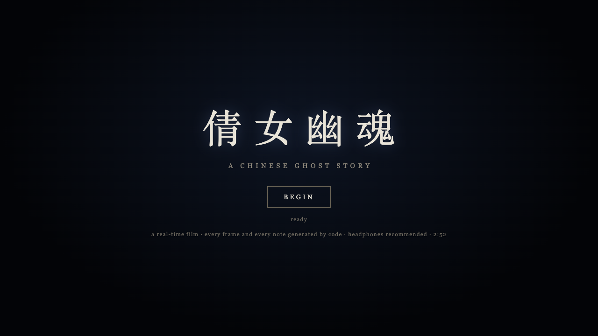</a> <a href="cinematic-short-film/the-living-light-film.html">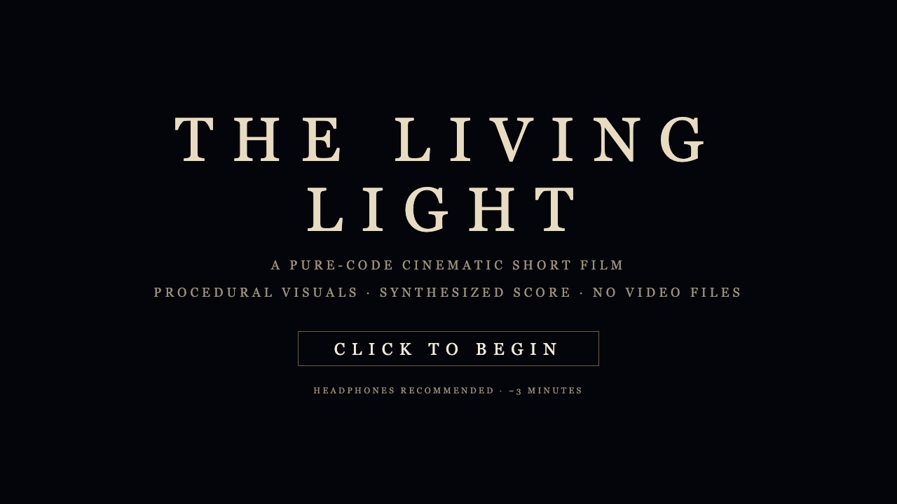</a>

Real-time cinematic films rendered entirely in code, with camera cuts, grading and lighting, plus an orchestral score synthesized with Web Audio. Two films: “A Chinese Ghost Story” and “The Living Light”.

| Active time | Output tokens | Total tokens |
|:-:|:-:|:-:|
| 56.7 min | 223,652 | 13.1M (13,116,691) |

**Output:** [倩女幽魂 · A Chinese Ghost Story](cinematic-short-film/qian_nu_you_hun.html) · [The Living Light](cinematic-short-film/the-living-light-film.html)  
**Task brief:** [pure code cinematic short file with synthesized score.md](cinematic-short-film/pure%20code%20cinematic%20short%20file%20with%20synthesized%20score.md)

---

## 2. Multi-Agent Painterly Animated Music Video Engine

**Media** · Main session

<a href="painterly-music-video/paper_sky_music_video.html">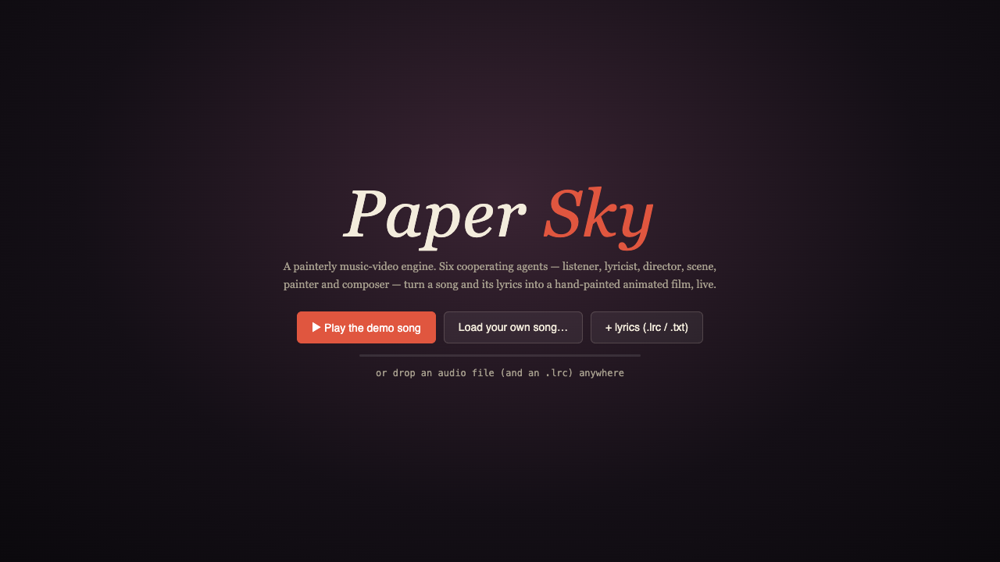</a> 

A 2.5-minute music video engine that uses brush-stroke shaders and matches its scenes to the beats and lyric timing. Two engines: Paper Sky and CHROMA, which also accepts your own uploaded track.

| Active time | Output tokens | Total tokens |
|:-:|:-:|:-:|
| 20.7 min | 89,611 | 5.1M (5,080,205) |

**Output:** [Paper Sky](painterly-music-video/paper_sky_music_video.html) · [CHROMA](painterly-music-video/chroma-mv-engine.html)  
**Task brief:** [multi-agent painterly animated music video engine.md](painterly-music-video/multi-agent%20painterly%20animated%20music%20video%20engine.md)

---

## 3. Rampart: 2D Castle Platformer

**Game** · Subagent

<a href="castle-platformer/rampart-castle-platformer.html">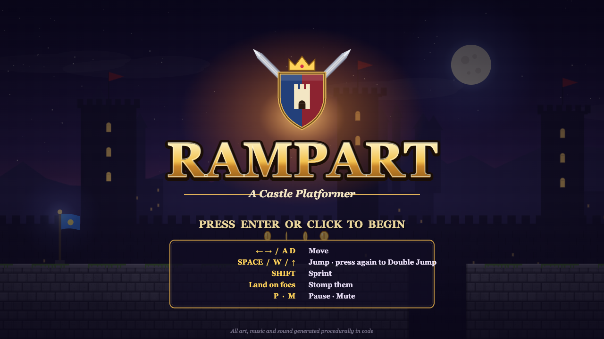</a>

A complete 2D castle platformer with procedural graphics, synthesized audio and a polished UI.

| Active time | Output tokens | Total tokens |
|:-:|:-:|:-:|
| 28.9 min | 62,498 | 2.7M (2,656,879) |

**Output:** [Play Rampart](castle-platformer/rampart-castle-platformer.html)  
**Task brief:** [2d castle platformer game.md](castle-platformer/2d%20castle%20platformer%20game.md)

---

## 4. Ember Souls: Dark Souls–Style Action RPG

**Game** · Subagent

<a href="souls-rpg/ember-souls-rpg.html">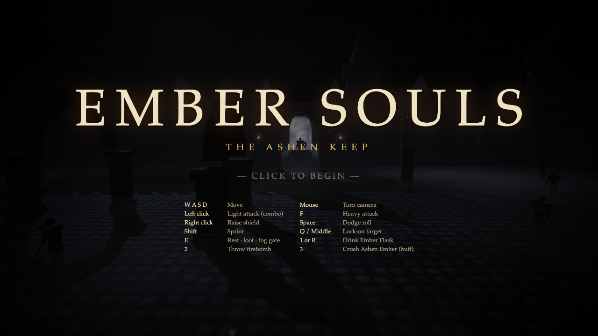</a>

A third-person Three.js action RPG with stamina combat, dodge rolls, lock-on, bonfires and a boss fight in the Ashen Keep.

| Active time | Output tokens | Total tokens |
|:-:|:-:|:-:|
| 42.6 min | 64,921 | 2.7M (2,723,937) |

**Output:** [Play Ember Souls](souls-rpg/ember-souls-rpg.html)  
**Task brief:** [dark souls style browser action RPG.md](souls-rpg/dark%20souls%20style%20browser%20action%20RPG.md)

---

## 5. Apex Circuit: 3D Arcade Racing

**Game** · Subagent

<a href="apex-circuit-racing/apex-circuit-racing.html">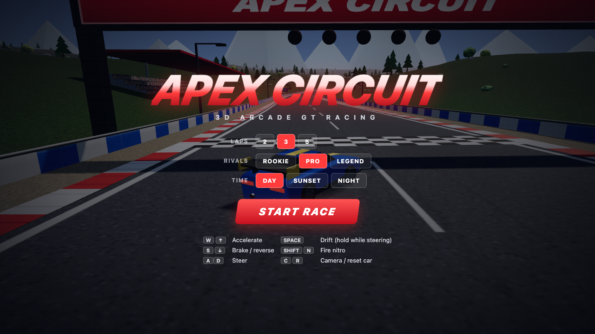</a>

A 3D arcade racer with car physics, AI opponents and a fully built race track.

| Active time | Output tokens | Total tokens |
|:-:|:-:|:-:|
| 39.4 min | 64,399 | 5.2M (5,239,907) |

**Output:** [Play Apex Circuit](apex-circuit-racing/apex-circuit-racing.html)  
**Task brief:** [apex circuit 3d arcade racing game.md](apex-circuit-racing/apex%20circuit%203d%20arcade%20racing%20game.md)

---

## 6. Kart Clash: Full Arcade Kart Racer

**Game** · Subagent

<a href="kart-racing/kart-racing-arcade.html">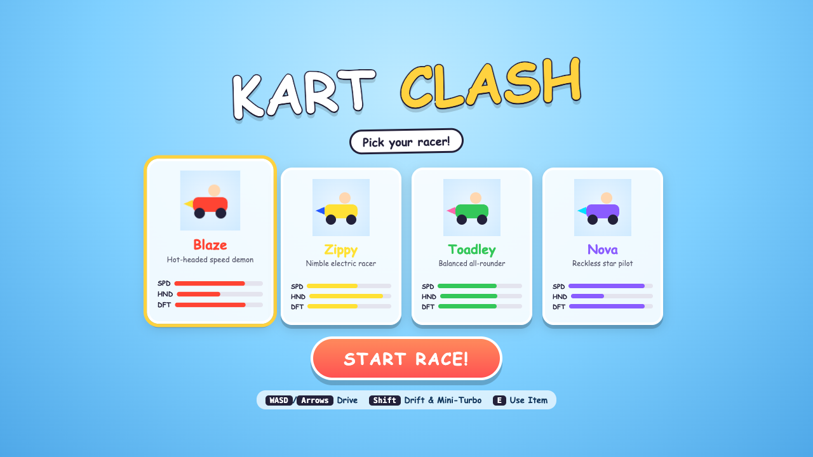</a>

A single-file Three.js kart racer with drifting, boosts, items and CPU rivals.

| Active time | Output tokens | Total tokens |
|:-:|:-:|:-:|
| 41.2 min | 49,196 | 3.1M (3,094,722) |

**Output:** [Play Kart Clash](kart-racing/kart-racing-arcade.html)  
**Task brief:** [full arcade kart racing game.md](kart-racing/full%20arcade%20kart%20racing%20game.md)

---

## 7. 3D Interactive Black Hole Simulation

**Simulation** · Subagent

<a href="black-hole-simulation/black-hole-simulation.html">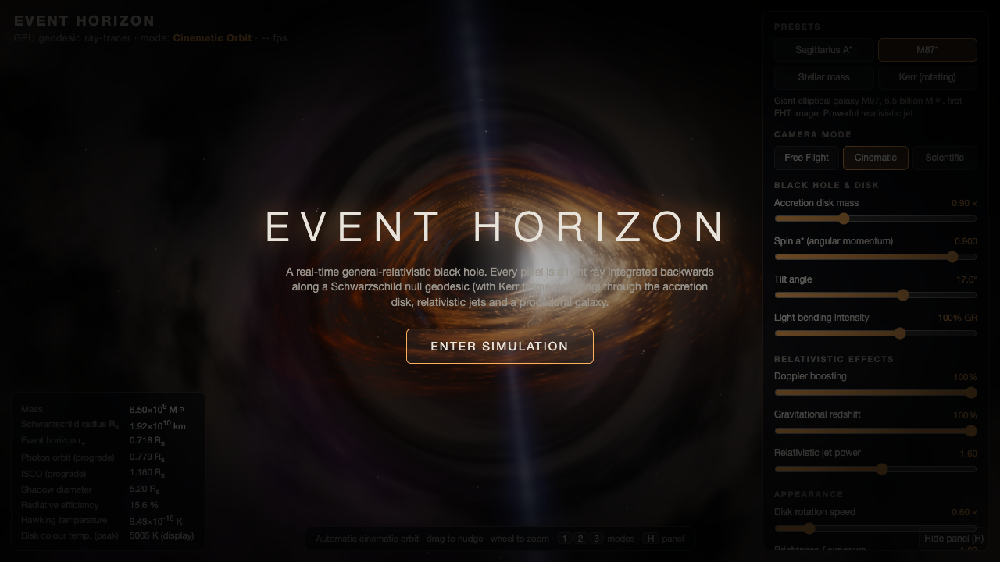</a>

A WebGL black hole with gravitational lensing, an accretion disk and interactive controls for its physical parameters.

> Built in the same agent run as *Black Hole Simulator (Chinese)*. The figures below cover both tasks.

| Active time | Output tokens | Total tokens |
|:-:|:-:|:-:|
| 29.6 min | 2,150 | 2.4M (2,373,772) |

**Output:** [Open simulation](black-hole-simulation/black-hole-simulation.html)  
**Task brief:** [3d black hole simulation.md](black-hole-simulation/3d%20black%20hole%20simulation.md)

---

## 8. 3D 黑洞模拟器 (Black Hole Simulator, Chinese)

**Simulation** · Subagent

<a href="black-hole-simulator-cn/black-hole-simulator-cn.html">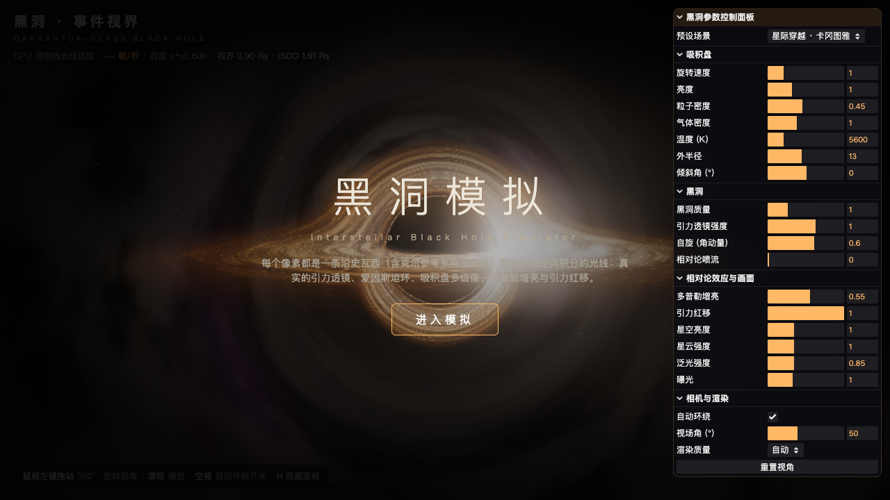</a>

The Chinese-language version: a single-file Three.js black hole renderer with lensing and accretion-disk physics.

> Built in the same agent run as *3D Interactive Black Hole Simulation*. The figures below cover both tasks.

| Active time | Output tokens | Total tokens |
|:-:|:-:|:-:|
| 29.6 min | 2,150 | 2.4M (2,373,772) |

**Output:** [打开模拟器](black-hole-simulator-cn/black-hole-simulator-cn.html)  
**Task brief:** [3d black hole simulator [Chinese].md](black-hole-simulator-cn/3d%20black%20hole%20simulator%20%5BChinese%5D.md)

---

## 9. F-35 Digital Wind Tunnel

**Simulation** · Subagent

<a href="f35-wind-tunnel/f35-wind-tunnel.html">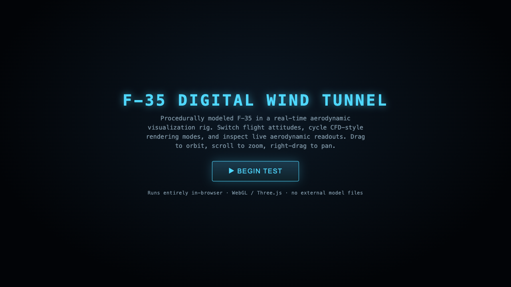</a>

An interactive wind tunnel with shader-based airflow, pressure maps, schlieren view, stall behavior and live aerodynamic readouts.

| Active time | Output tokens | Total tokens |
|:-:|:-:|:-:|
| 24.3 min | 28,548 | 3.6M (3,607,863) |

**Output:** [Open wind tunnel](f35-wind-tunnel/f35-wind-tunnel.html)  
**Task brief:** [f35 digital wind tunnel simulator.md](f35-wind-tunnel/f35%20digital%20wind%20tunnel%20simulator.md)

---

## 10. Real-Time Viscous Thread Coiling (Honey)

**Simulation** · Subagent

<a href="honey-coiling/honey-coiling.html">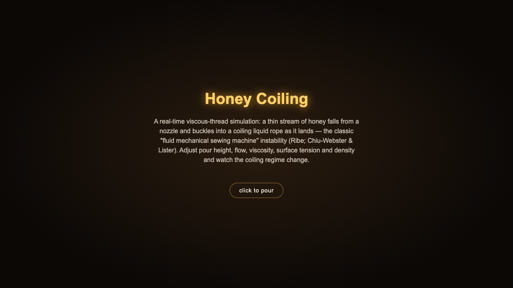</a>

Honey falling onto a flat surface, showing the coiling instability of a viscous thread in real time.

> Built in the same agent run as *Syrup on a Moving Conveyor Belt*. The figures below cover both tasks.

| Active time | Output tokens | Total tokens |
|:-:|:-:|:-:|
| 1h 5m | 68,048 | 8.3M (8,344,049) |

**Output:** [Open simulation](honey-coiling/honey-coiling.html)  
**Task brief:** [realtime viscous thread coiling simulation.md](honey-coiling/realtime%20viscous%20thread%20coiling%20simulation.md)

---

## 11. Syrup on a Moving Conveyor Belt

**Simulation** · Subagent

<a href="syrup-conveyor-belt/syrup-conveyor-belt.html">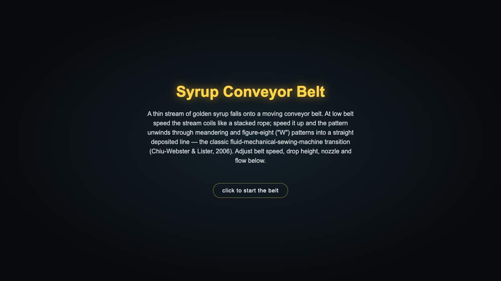</a>

A viscous stream falling onto a moving belt, where belt speed produces coiling, meandering and buckling patterns.

> Built in the same agent run as *Real-Time Viscous Thread Coiling (Honey)*. The figures below cover both tasks.

| Active time | Output tokens | Total tokens |
|:-:|:-:|:-:|
| 1h 5m | 68,048 | 8.3M (8,344,049) |

**Output:** [Open simulation](syrup-conveyor-belt/syrup-conveyor-belt.html)  
**Task brief:** [syrup moving belt physics.md](syrup-conveyor-belt/syrup%20moving%20belt%20physics.md)

---

## 12. Saturn’s Rings Bird Bicycle Race (SVG)

**Animation** · Subagent

<a href="saturn-bird-race/saturn-rings-bird-race.html">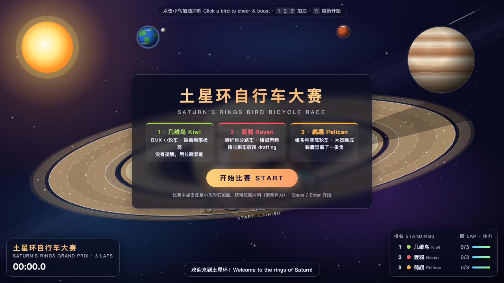</a>

A humorous interactive SVG animation of birds racing bicycles around Saturn’s rings.

| Active time | Output tokens | Total tokens |
|:-:|:-:|:-:|
| 24.3 min | 44,413 | 1.8M (1,754,414) |

**Output:** [Watch the race](saturn-bird-race/saturn-rings-bird-race.html)  
**Task brief:** [staturn's rings bird bicycle race svg.md](saturn-bird-race/staturn%27s%20rings%20bird%20bicycle%20race%20svg.md)

---

## 13. Procedural Pixel Art Wizard

**Animation** · Subagent

<a href="pixel-wizard/pixel-wizard.html">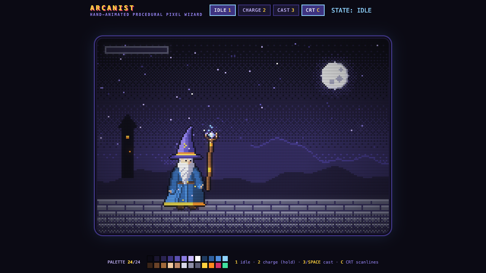</a>

A retro pixel-art wizard drawn and animated entirely in code (idle, casting and spell effects) with no image files.

| Active time | Output tokens | Total tokens |
|:-:|:-:|:-:|
| 29.9 min | 17,979 | 2.0M (2,023,562) |

**Output:** [Meet the wizard](pixel-wizard/pixel-wizard.html)  
**Task brief:** [hand animated procedural pxiel art wizard character.md](pixel-wizard/hand%20animated%20procedural%20pxiel%20art%20wizard%20character.md)

---

## 14. Antikythera Mechanism Reconstruction

**3D** · Subagent

<a href="antikythera-reconstruction/antikythera-reconstruction.html">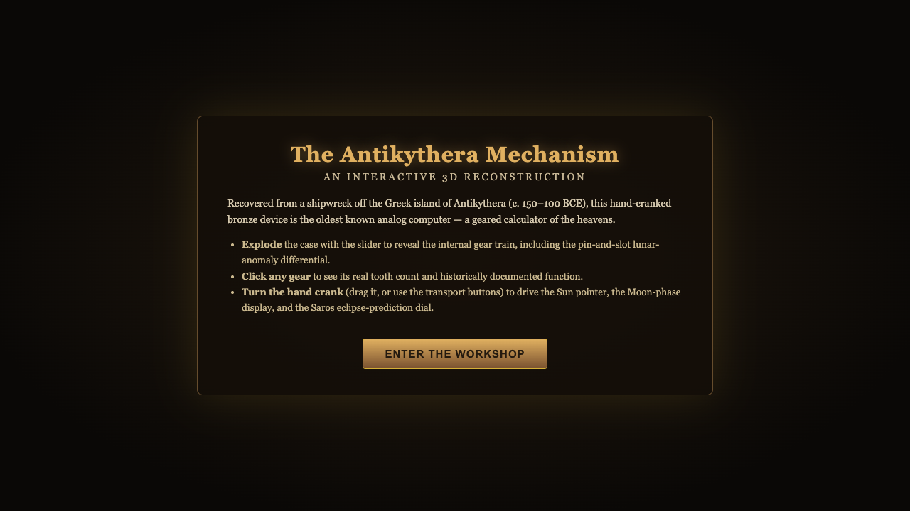</a>

An interactive 3D reconstruction of the ancient Greek astronomical calculator, with an exploded view and working gear trains.

| Active time | Output tokens | Total tokens |
|:-:|:-:|:-:|
| 36.5 min | 34,459 | 5.5M (5,507,151) |

**Output:** [Explore the mechanism](antikythera-reconstruction/antikythera-reconstruction.html)  
**Task brief:** [antikythera astronomical calcuator reconstruction.md](antikythera-reconstruction/antikythera%20astronomical%20calcuator%20reconstruction.md)

---

## 15. 3D Gear-Driven Mechanical Calculator

**3D** · Subagent

<a href="gear-calculator/gear-mechanical-calculator.html">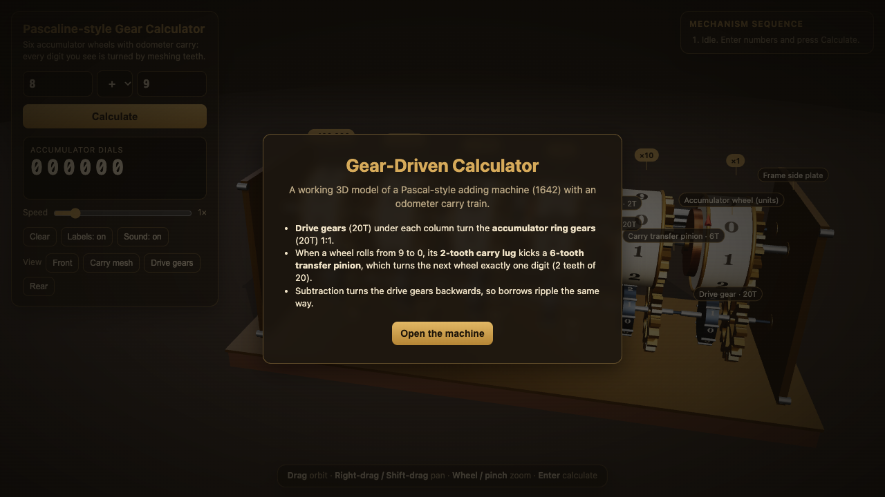</a>

A working Pascaline-style adding machine in which meshing teeth turn every digit, with a visible odometer carry train and borrow handling.

| Active time | Output tokens | Total tokens |
|:-:|:-:|:-:|
| 1h 4m | 31,925 | 3.5M (3,463,546) |

**Output:** [Open the machine](gear-calculator/gear-mechanical-calculator.html)  
**Task brief:** [3d gear driver mechanical calculator.md](gear-calculator/3d%20gear%20driver%20mechanical%20calculator.md)

---

## 16. Music Player (Apple Music–Style macOS App)

**App** · Main session

<a href="music-player/music-player/">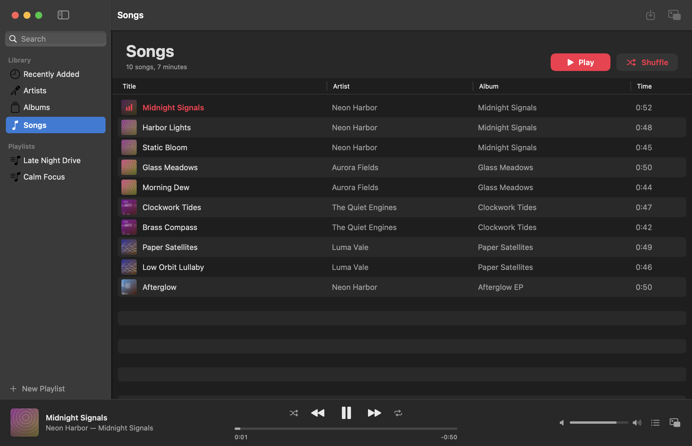</a>

A native SwiftUI + AVFoundation player with a translucent sidebar, Songs / Albums / Artists / Playlists views, a Now Playing bar, a floating Mini Player, file import and built-in synthesized sample tracks. The Swift package builds with `swift run` on macOS 14+ (Command Line Tools are enough).

> Built in the same run as its EN/CN counterpart (figures cover both). The packages were first written by a subagent on 29–30 Sep, which isn't counted; the figures cover the 1 Oct session that got both building and checked.

| Active time | Output tokens | Total tokens |
|:-:|:-:|:-:|
| 53.7 min | 44,730 | 9.6M (9,612,102) |

**Output:** [Source & build steps](music-player/music-player/)  
**Task brief:** [music player.md](music-player/music%20player.md)

---

## 17. 悦听 Music Player (Chinese macOS App)

**App** · Main session

<a href="music-player-cn/music-player-cn/">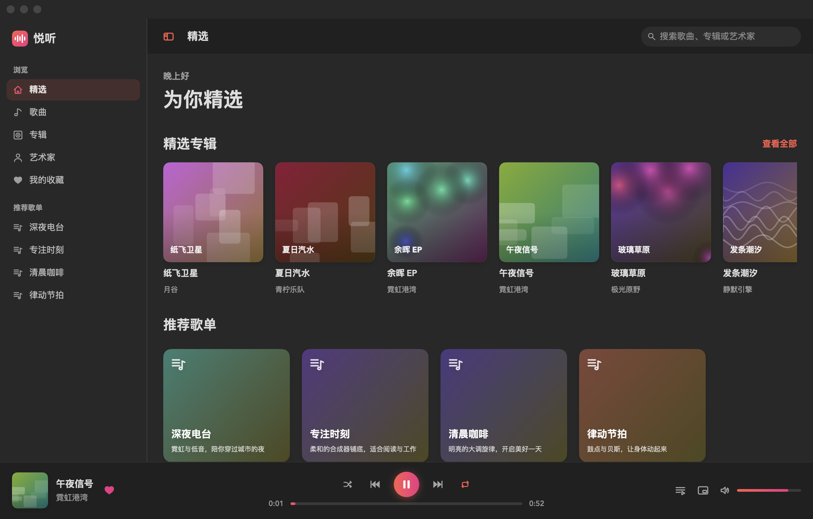</a>

The Chinese-language macOS player: featured album and playlist grids, artist browsing, an Up Next queue, favourites, a collapsible frosted-glass sidebar and a mini player, with synthesized demo audio. The Swift package builds with `swift run` on macOS 14+ (Command Line Tools are enough).

> Built in the same run as its EN/CN counterpart (figures cover both). The packages were first written by a subagent on 29–30 Sep, which isn't counted; the figures cover the 1 Oct session that got both building and checked.

| Active time | Output tokens | Total tokens |
|:-:|:-:|:-:|
| 53.7 min | 44,730 | 9.6M (9,612,102) |

**Output:** [查看源码与构建说明](music-player-cn/music-player-cn/)  
**Task brief:** [music player[Chinese].md](music-player-cn/music%20player%5BChinese%5D.md)

---

## 18. Fox Lantern Adventure: 3D Action Platformer

**Game** · Main session

<a href="fox-lantern-adventure/fox-lantern-adventure.html">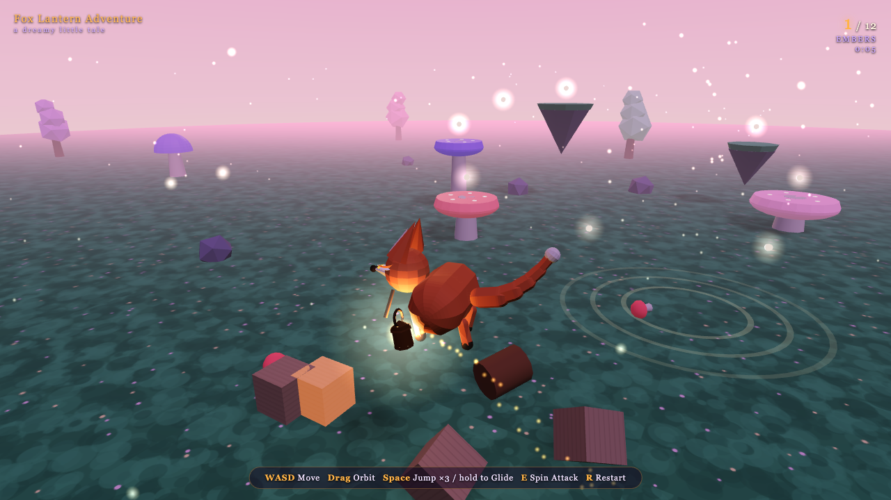</a>

A big-eyed fox with a glowing lantern, springy ears and a physics tail: triple jump, glide and a spin attack that sends crates flying while you gather 12 embers across a dreamy glade.

> A first version built by a subagent on 30 Sep isn't counted; the figures cover the 1 Oct session that finished it.

| Active time | Output tokens | Total tokens |
|:-:|:-:|:-:|
| 21.1 min | 20,120 | 1.8M (1,773,032) |

**Output:** [Play Fox Lantern](fox-lantern-adventure/fox-lantern-adventure.html)  
**Task brief:** [3d fox action game.md](fox-lantern-adventure/3d%20fox%20action%20game.md)

---

## 19. Easter Island Moai: Quarry to Pukao (摩艾全流程模拟)

**Simulation** · Main session

<a href="moai-process-simulator/moai-process-simulator.html">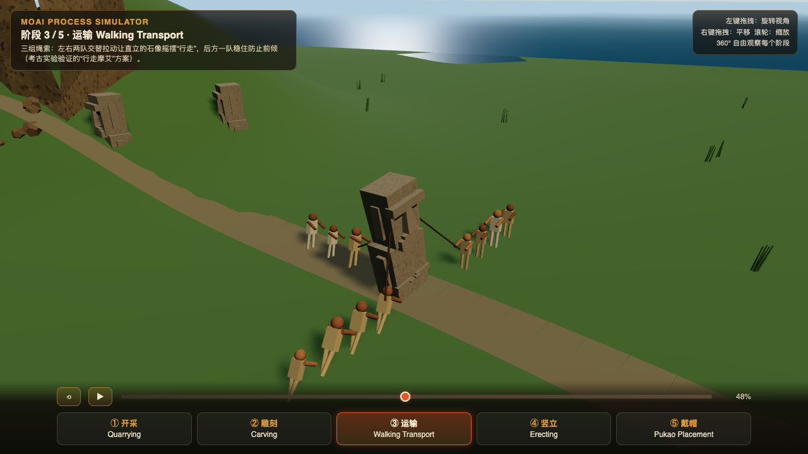</a>

Five stages grounded in archaeology: quarrying at Rano Raraku, carving, the rope-rocked “walking moai”, raising the statue on the ahu with levers and packed stones, and rolling the red pukao up a ramp. 360° view and a scrubbable timeline.

> A first version built by a subagent on 30 Sep isn't counted; the figures cover the 1 Oct session that finished it.

| Active time | Output tokens | Total tokens |
|:-:|:-:|:-:|
| 1h 1m | 62,137 | 5.2M (5,220,450) |

**Output:** [Open simulator](moai-process-simulator/moai-process-simulator.html)  
**Task brief:** [easter island moai process simulator.md](moai-process-simulator/easter%20island%20moai%20process%20simulator.md)

---

## 20. Chinese Ink-Wash Painting (3 Scenes)

**Animation** · Main session

<a href="ink-wash-painting/ink-wash-painting.html">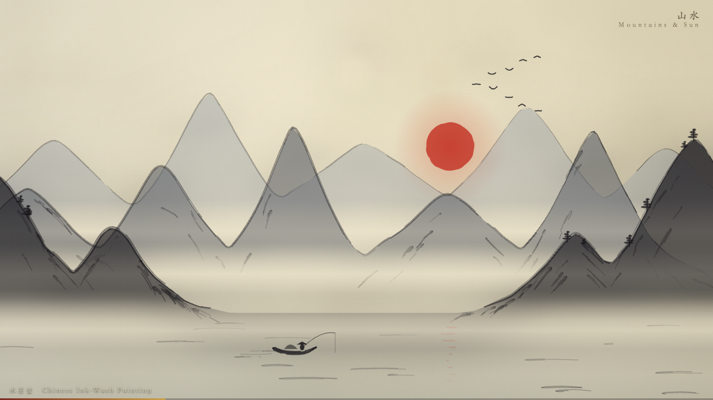</a>

Ink blooms across rice paper into misty mountains and a rising sun, a lotus pond, and a plum branch under the moon, painted with a dry-brush engine and scored with a synthesized guqin.

> Built in the same run as its EN/CN counterpart (figures cover both). An earlier subagent attempt on 30 Sep isn't counted.

| Active time | Output tokens | Total tokens |
|:-:|:-:|:-:|
| 1h 48m | 101,330 | 16.9M (16,911,597) |

**Output:** [Watch the painting](ink-wash-painting/ink-wash-painting.html)  
**Task brief:** [chinese ink-wash painting animation.md](ink-wash-painting/chinese%20ink-wash%20painting%20animation.md)

---

## 21. 水墨 · 七幕 (Ink-Wash in Seven Acts, Chinese)

**Animation** · Main session

<a href="ink-wash-seven-acts-cn/ink-wash-seven-acts-cn.html">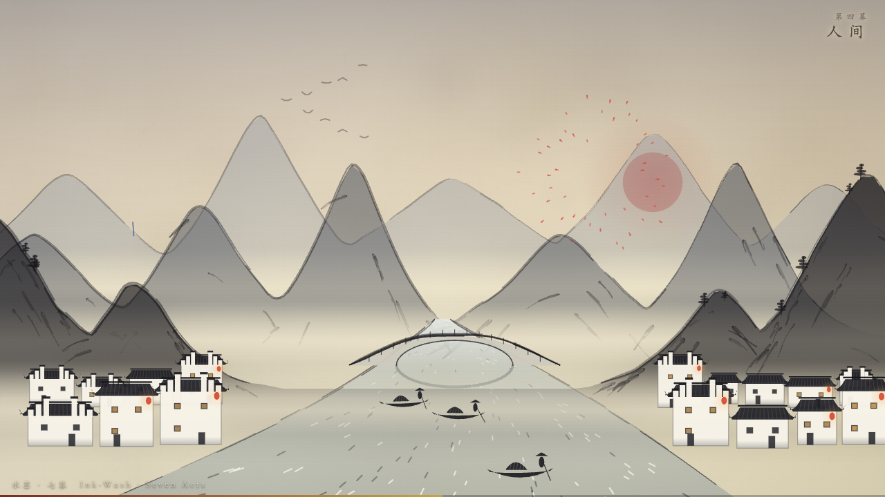</a>

A two-minute ink scroll in seven acts: a falling drop, mountains, a river bursting from a gorge, a Jiangnan water town with fireworks, a storm, a red-crowned crane breaking the clouds, and everything returning to one drop of ink.

> Built in the same run as its EN/CN counterpart (figures cover both). An earlier subagent attempt on 30 Sep isn't counted.

| Active time | Output tokens | Total tokens |
|:-:|:-:|:-:|
| 1h 48m | 101,330 | 16.9M (16,911,597) |

**Output:** [观看七幕](ink-wash-seven-acts-cn/ink-wash-seven-acts-cn.html)  
**Task brief:** [chinese ink canvas animation Chinese.md](ink-wash-seven-acts-cn/chinese%20ink%20canvas%20animation%20Chinese.md)

---

## 22. Interactive Procedural Wallpaper

**Animation** · Muse · finished by Claude

<a href="interactive-procedural-wallpaper/interactive-procedural-wallpaper.html">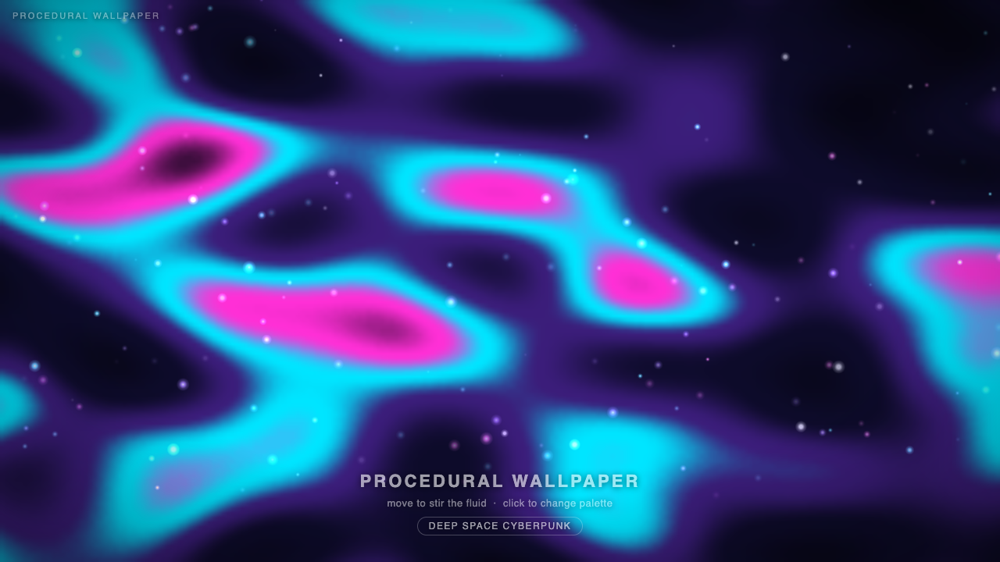</a>

A lightweight canvas wallpaper of noise-driven colour flows and glowing particles that ripple away from the cursor. Click to cycle three palettes.

> First built by Codex or Muse; Claude then checked all eight and filled the gaps in one run. The figures cover Claude's finishing work for all eight (filing and publishing excluded) and leave out Codex's and Muse's own usage, which isn't recorded.

| Active time | Output tokens | Total tokens |
|:-:|:-:|:-:|
| 42.8 min | 47,758 | 29.3M (29,324,451) |

**Output:** [Open wallpaper](interactive-procedural-wallpaper/interactive-procedural-wallpaper.html)  
**Task brief:** [Interactive Procedural Animated Canvas Wallpaper.md](interactive-procedural-wallpaper/Interactive%20Procedural%20Animated%20Canvas%20Wallpaper.md)

---

## 23. OVERDRIVE: 15-Second Kinetic Showreel

**Animation** · Codex · finished by Claude

<a href="kinetic-showreel/kinetic-showreel.html">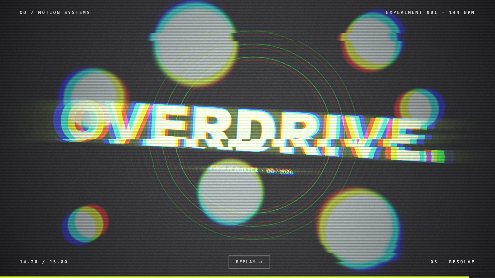</a>

A 144 BPM motion-graphics piece: five acts of kinetic typography, hard camera cuts, liquid morphing and particle bursts, run through a WebGL pass for chromatic aberration, glare and glitch, with a synthesized track.

> First built by Codex or Muse; Claude then checked all eight and filled the gaps in one run. The figures cover Claude's finishing work for all eight (filing and publishing excluded) and leave out Codex's and Muse's own usage, which isn't recorded.

| Active time | Output tokens | Total tokens |
|:-:|:-:|:-:|
| 42.8 min | 47,758 | 29.3M (29,324,451) |

**Output:** [Play showreel](kinetic-showreel/kinetic-showreel.html)  
**Task brief:** [motion designer 15-second high octane kinetic showreel.md](kinetic-showreel/motion%20designer%2015-second%20high%20octane%20kinetic%20showreel.md)

---

## 24. Voxel Tides: Browser Voxel Engine

**Game** · Codex · finished by Claude

<a href="voxel-tides/voxel-tides.html">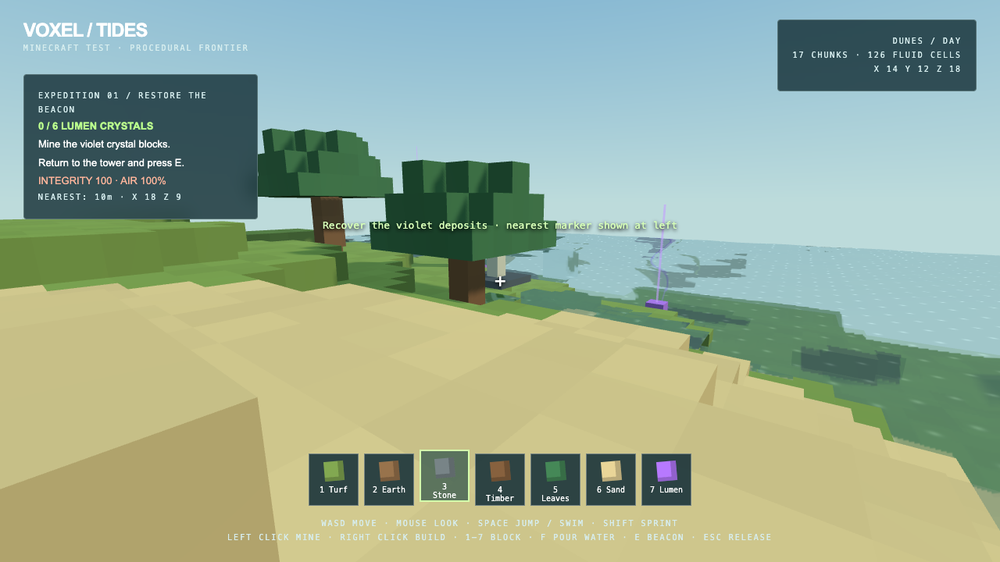</a>

A streaming voxel world with Perlin terrain, caves, biomes and trees, a day–night sky, soft shadows, reflective and refractive water with flowing fluid, and a crystal-hunt goal.

> First built by Codex or Muse; Claude then checked all eight and filled the gaps in one run. The figures cover Claude's finishing work for all eight (filing and publishing excluded) and leave out Codex's and Muse's own usage, which isn't recorded.

| Active time | Output tokens | Total tokens |
|:-:|:-:|:-:|
| 42.8 min | 47,758 | 29.3M (29,324,451) |

**Output:** [Play Voxel Tides](voxel-tides/voxel-tides.html)  
**Task brief:** [brower based voxel engine with shaders & water physics.md](voxel-tides/brower%20based%20voxel%20engine%20with%20shaders%20%26%20water%20physics.md)

---

## 25. Dead Signal: Atmospheric FPS

**Game** · Codex · finished by Claude

<a href="dead-signal/dead-signal.html">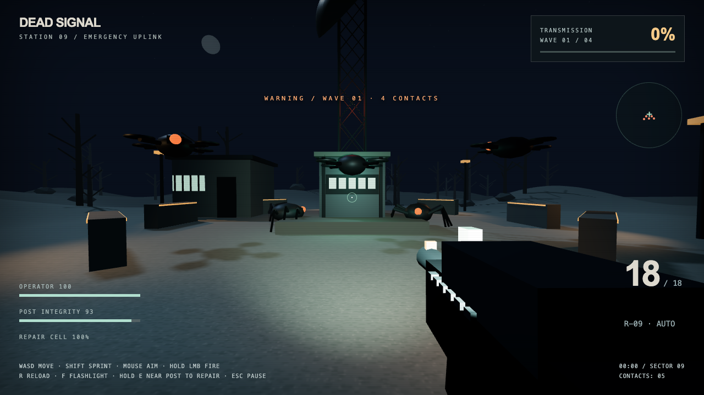</a>

Defend a remote radio post from waves of spider and flying drones with a flashlight-lit rifle, recoil and reloads, until the transmission reaches 100% and fires its beam into the sky.

> First built by Codex or Muse; Claude then checked all eight and filled the gaps in one run. The figures cover Claude's finishing work for all eight (filing and publishing excluded) and leave out Codex's and Muse's own usage, which isn't recorded.

| Active time | Output tokens | Total tokens |
|:-:|:-:|:-:|
| 42.8 min | 47,758 | 29.3M (29,324,451) |

**Output:** [Play Dead Signal](dead-signal/dead-signal.html)  
**Task brief:** [dead signal atmospheric first person shooter.md](dead-signal/dead%20signal%20atmospheric%20first%20person%20shooter.md)

---

## 26. Hikari: Glass Tiles from Day to Night

**Animation** · Codex · finished by Claude

<a href="glass-tile-cycle/glass-tile-cycle.html">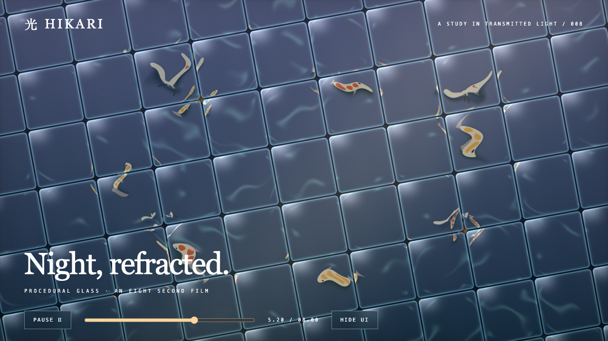</a>

An eight-second shader loop of refractive glass tiles with colour dispersion and caustics. Koi, cranes and doves drift beneath the glass as daylight turns gold and then indigo.

> First built by Codex or Muse; Claude then checked all eight and filled the gaps in one run. The figures cover Claude's finishing work for all eight (filing and publishing excluded) and leave out Codex's and Muse's own usage, which isn't recorded.

| Active time | Output tokens | Total tokens |
|:-:|:-:|:-:|
| 42.8 min | 47,758 | 29.3M (29,324,451) |

**Output:** [Watch the loop](glass-tile-cycle/glass-tile-cycle.html)  
**Task brief:** [glass tile day-to-night ambiet visual experience.md](glass-tile-cycle/glass%20tile%20day-to-night%20ambiet%20visual%20experience.md)

---

## 27. Neutron Star: Magnetic Field and Polar Jets

**Simulation** · Muse · finished by Claude

<a href="neutron-star/neutron-star.html">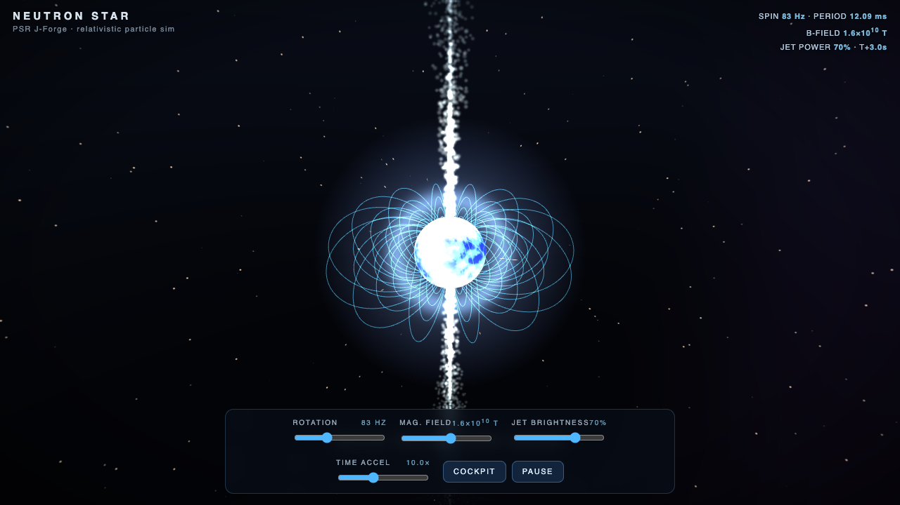</a>

A spinning neutron star with a glowing core, dipole field lines, relativistic polar jets and a lensed starfield, with sliders for spin, field strength, jet brightness and time.

> First built by Codex or Muse; Claude then checked all eight and filled the gaps in one run. The figures cover Claude's finishing work for all eight (filing and publishing excluded) and leave out Codex's and Muse's own usage, which isn't recorded.

| Active time | Output tokens | Total tokens |
|:-:|:-:|:-:|
| 42.8 min | 47,758 | 29.3M (29,324,451) |

**Output:** [Open simulation](neutron-star/neutron-star.html)  
**Task brief:** [neutron star pyhsics & compit animation.md](neutron-star/neutron%20star%20pyhsics%20%26%20compit%20animation.md)

---

## 28. Butterfly Life Cycle

**Animation** · Muse · finished by Claude

<a href="butterfly-life-cycle/butterfly-life-cycle.html">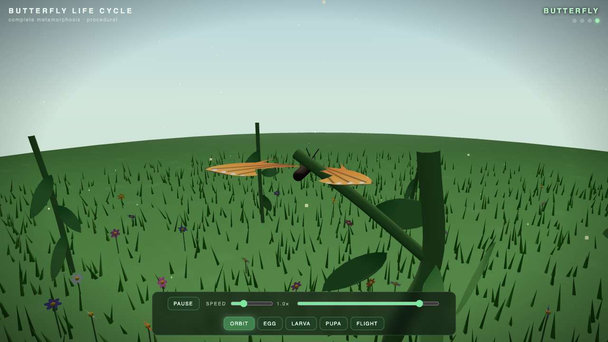</a>

A continuous 3D metamorphosis in a meadow: the egg hatches, the caterpillar eats its way up the plant, forms a chrysalis, and the butterfly emerges and flies off. Play, speed, scrub and stage cameras.

> First built by Codex or Muse; Claude then checked all eight and filled the gaps in one run. The figures cover Claude's finishing work for all eight (filing and publishing excluded) and leave out Codex's and Muse's own usage, which isn't recorded.

| Active time | Output tokens | Total tokens |
|:-:|:-:|:-:|
| 42.8 min | 47,758 | 29.3M (29,324,451) |

**Output:** [Watch the cycle](butterfly-life-cycle/butterfly-life-cycle.html)  
**Task brief:** [buttefly lift cycle procedural animation.md](butterfly-life-cycle/buttefly%20lift%20cycle%20procedural%20animation.md)

---

## 29. Void Wing: Space Dogfight & Asteroid Battle

**Game** · Muse · finished by Claude

<a href="void-wing/void-wing.html">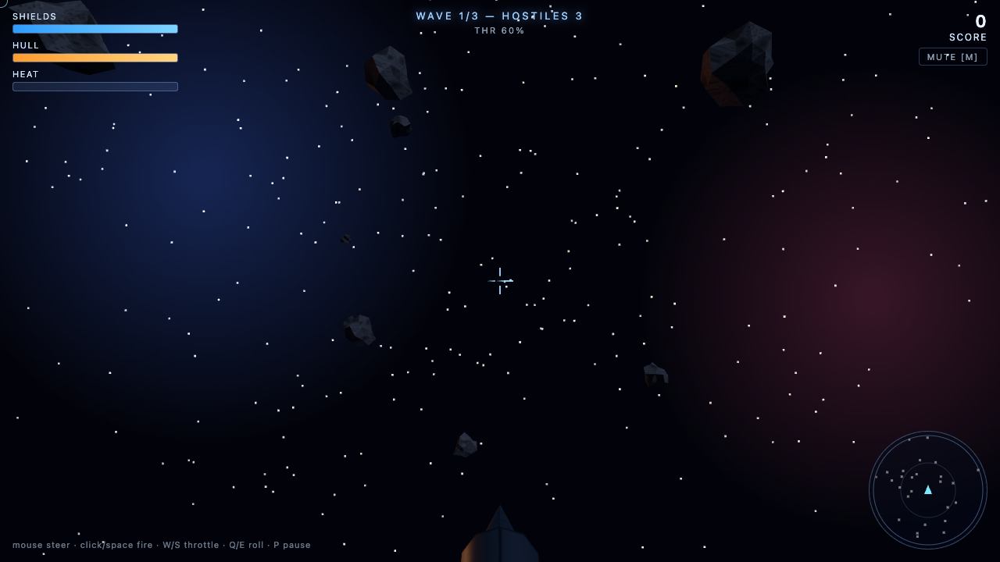</a>

3D space combat with throttle, roll and heat-managed blasters, AI fighters firing plasma, asteroids that fracture, engine trails, radar and a synthesized score across three waves.

> First built by Codex or Muse; Claude then checked all eight and filled the gaps in one run. The figures cover Claude's finishing work for all eight (filing and publishing excluded) and leave out Codex's and Muse's own usage, which isn't recorded.

| Active time | Output tokens | Total tokens |
|:-:|:-:|:-:|
| 42.8 min | 47,758 | 29.3M (29,324,451) |

**Output:** [Play Void Wing](void-wing/void-wing.html)  
**Task brief:** [void wing 3d space dogfight &asteroid battle.md](void-wing/void%20wing%203d%20space%20dogfight%20%26asteroid%20battle.md)

---

## 30. Quantum Collapse: Two Observers vs Three (CN)

**Explainer** · Main session

<a href="quantum-collapse/quantum-collapse.html">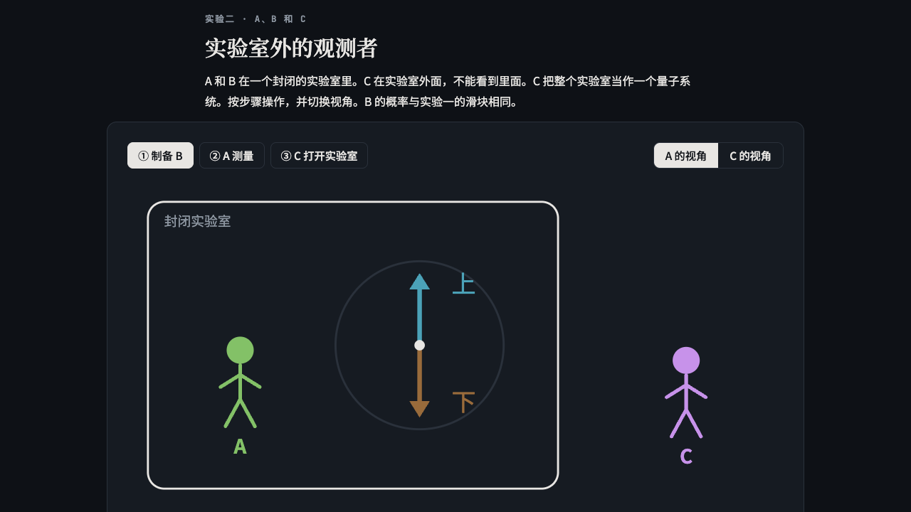</a>

A Chinese explainer on wavefunction collapse when A measures B, and when an outside observer C watches the sealed lab (Wigner's friend). It comes as an interactive page with two hands-on experiments, a narrated 2-minute 20-second video and two diagrams.

> Built in a session in the my-articles project; the figures cover that session from the Chinese explanation request to the finished outputs.

| Active time | Output tokens | Total tokens |
|:-:|:-:|:-:|
| 11.8 min | 44,124 | 1.4M (1,400,877) |

**Output:** [Open the explainer](quantum-collapse/quantum-collapse.html) · [Video (2:20)](quantum-collapse/quantum-collapse-explainer.mp4) · [Diagram: A and B](quantum-collapse/fig1-ab-collapse.png) · [Diagram: A, B and C](quantum-collapse/fig2-abc-wigners-friend.png) 
**Task brief:** [quantum-collapse.md](quantum-collapse/quantum-collapse.md)

---

## 31. Sketch Trebuchet: Drawing to Physics Simulator

**Simulation** · Main session

<a href="sketch-trebuchet/sketch-trebuchet.html">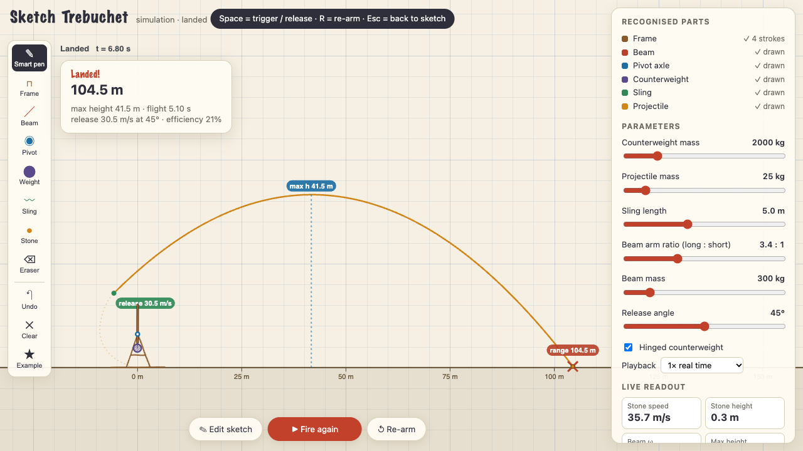</a>

Sketch a trebuchet on graph paper and the app recognises the frame, beam, pivot, counterweight, sling and stone, then launches it with a multibody physics engine. Trace the arc, max height, release speed and range, and tune masses, sling length, arm ratio and release angle.

> Built in the same agent run as *Acrylic Marker Flip Sketchbook*; the figures cover both tasks.

| Active time | Output tokens | Total tokens |
|:-:|:-:|:-:|
| 1h 4m | 118,291 | 4.0M (4,035,099) |

**Output:** [Draw and launch](sketch-trebuchet/sketch-trebuchet.html) 
**Task brief:** [drawing to trebuchet sim.md](sketch-trebuchet/drawing%20to%20trebuchet%20sim.md)

---

## 32. Acrylic Marker Flip Sketchbook

**Animation** · Main session

<a href="acrylic-sketchbook/acrylic-sketchbook.html">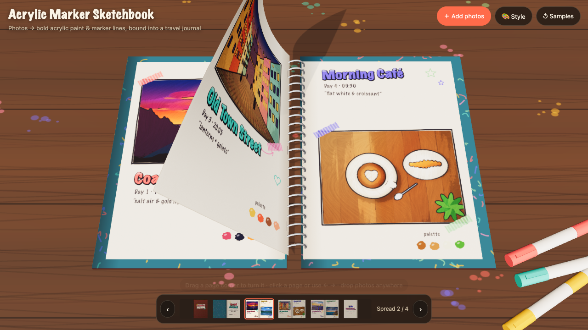</a>

Photos are repainted by a WebGL acrylic-and-marker filter and bound into a spiral sketchbook whose pages curl, twist and cast shadows as you drag them. Six procedural sample photos make a travel journal out of the box; add your own by upload or drag-and-drop.

> Built in the same agent run as *Sketch Trebuchet: Drawing to Physics Simulator*; the figures cover both tasks.

| Active time | Output tokens | Total tokens |
|:-:|:-:|:-:|
| 1h 4m | 118,291 | 4.0M (4,035,099) |

**Output:** [Open the sketchbook](acrylic-sketchbook/acrylic-sketchbook.html) 
**Task brief:** [acrylic maker interactive flip sketchbook.md](acrylic-sketchbook/acrylic%20maker%20interactive%20flip%20sketchbook.md)

---

## Full token breakdown

| Task | Active | Input | Cache write | Cache read | Output | Total |
|:--|--:|--:|--:|--:|--:|--:|
| Pure-Code Cinematic Short Film with Synthesized Score | 56.7 min | 98 | 271,307 | 12,621,634 | 223,652 | 13,116,691 |
| Multi-Agent Painterly Animated Music Video Engine | 20.7 min | 28 | 411,415 | 4,579,151 | 89,611 | 5,080,205 |
| Rampart: 2D Castle Platformer | 28.9 min | 58 | 226,497 | 2,367,826 | 62,498 | 2,656,879 |
| Ember Souls: Dark Souls–Style Action RPG | 42.6 min | 52 | 398,299 | 2,260,665 | 64,921 | 2,723,937 |
| Apex Circuit: 3D Arcade Racing | 39.4 min | 98 | 730,308 | 4,445,102 | 64,399 | 5,239,907 |
| Kart Clash: Full Arcade Kart Racer | 41.2 min | 66 | 275,847 | 2,769,613 | 49,196 | 3,094,722 |
| 3D Interactive Black Hole Simulation \* | 29.6 min | 62 | 198,038 | 2,173,522 | 2,150 | 2,373,772 |
| 3D 黑洞模拟器 (Black Hole Simulator, Chinese) \* | 29.6 min | 62 | 198,038 | 2,173,522 | 2,150 | 2,373,772 |
| F-35 Digital Wind Tunnel | 24.3 min | 74 | 212,691 | 3,366,550 | 28,548 | 3,607,863 |
| Real-Time Viscous Thread Coiling (Honey) \* | 1h 5m | 122 | 660,500 | 7,615,379 | 68,048 | 8,344,049 |
| Syrup on a Moving Conveyor Belt \* | 1h 5m | 122 | 660,500 | 7,615,379 | 68,048 | 8,344,049 |
| Saturn’s Rings Bird Bicycle Race (SVG) | 24.3 min | 44 | 194,910 | 1,515,047 | 44,413 | 1,754,414 |
| Procedural Pixel Art Wizard | 29.9 min | 56 | 178,363 | 1,827,164 | 17,979 | 2,023,562 |
| Antikythera Mechanism Reconstruction | 36.5 min | 92 | 337,400 | 5,135,200 | 34,459 | 5,507,151 |
| 3D Gear-Driven Mechanical Calculator | 1h 4m | 88 | 461,041 | 2,970,492 | 31,925 | 3,463,546 |
| Music Player (Apple Music–Style macOS App) \* | 53.7 min | 190 | 89,015 | 9,478,167 | 44,730 | 9,612,102 |
| 悦听 Music Player (Chinese macOS App) \* | 53.7 min | 190 | 89,015 | 9,478,167 | 44,730 | 9,612,102 |
| Fox Lantern Adventure: 3D Action Platformer | 21.1 min | 40 | 61,668 | 1,691,204 | 20,120 | 1,773,032 |
| Easter Island Moai: Quarry to Pukao (摩艾全流程模拟) | 1h 1m | 60 | 125,136 | 5,033,117 | 62,137 | 5,220,450 |
| Chinese Ink-Wash Painting (3 Scenes) \* | 1h 48m | 84 | 199,247 | 16,610,936 | 101,330 | 16,911,597 |
| 水墨 · 七幕 (Ink-Wash in Seven Acts, Chinese) \* | 1h 48m | 84 | 199,247 | 16,610,936 | 101,330 | 16,911,597 |
| Interactive Procedural Wallpaper † | 42.8 min | 104 | 135,232 | 29,141,357 | 47,758 | 29,324,451 |
| OVERDRIVE: 15-Second Kinetic Showreel † | 42.8 min | 104 | 135,232 | 29,141,357 | 47,758 | 29,324,451 |
| Voxel Tides: Browser Voxel Engine † | 42.8 min | 104 | 135,232 | 29,141,357 | 47,758 | 29,324,451 |
| Dead Signal: Atmospheric FPS † | 42.8 min | 104 | 135,232 | 29,141,357 | 47,758 | 29,324,451 |
| Hikari: Glass Tiles from Day to Night † | 42.8 min | 104 | 135,232 | 29,141,357 | 47,758 | 29,324,451 |
| Neutron Star: Magnetic Field and Polar Jets † | 42.8 min | 104 | 135,232 | 29,141,357 | 47,758 | 29,324,451 |
| Butterfly Life Cycle † | 42.8 min | 104 | 135,232 | 29,141,357 | 47,758 | 29,324,451 |
| Void Wing: Space Dogfight & Asteroid Battle † | 42.8 min | 104 | 135,232 | 29,141,357 | 47,758 | 29,324,451 |
| Quantum Collapse: Two Observers vs Three (CN) | 11.8 min | 32 | 67,270 | 1,289,451 | 44,124 | 1,400,877 |
| Sketch Trebuchet: Drawing to Physics Simulator \* | 1h 4m | 54 | 173,714 | 3,743,040 | 118,291 | 4,035,099 |
| Acrylic Marker Flip Sketchbook \* | 1h 4m | 54 | 173,714 | 3,743,040 | 118,291 | 4,035,099 |

\* One agent run covered both tasks in the pair; each pair is counted once in the totals.  
† First built by Codex or Muse and finished by Claude. The figures are Claude’s finishing work for all eight in one run (counted once in the totals; filing and publishing excluded); Codex’s and Muse’s own usage isn’t recorded.

Source: Claude Code session transcripts, 28 Sep – 6 Oct 2026. Screenshots were taken with headless Chrome at 1280×720.

## License

The generated code (the `.html` outputs and `index.html`) is released under the [MIT License](LICENSE). The task brief `.md` files and the screenshots are not covered by it.
